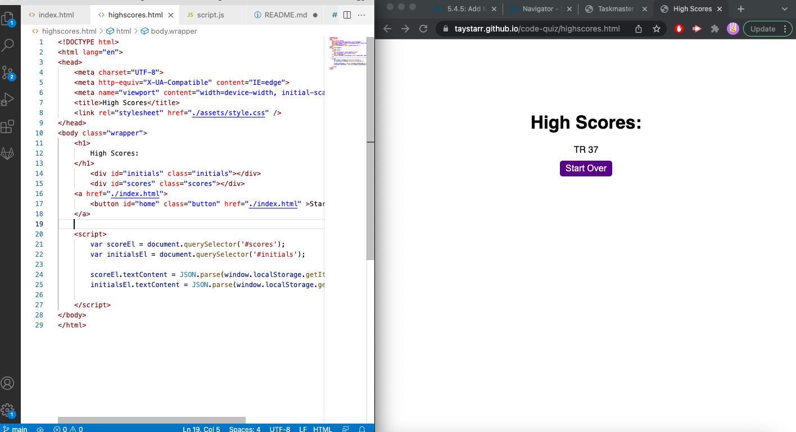
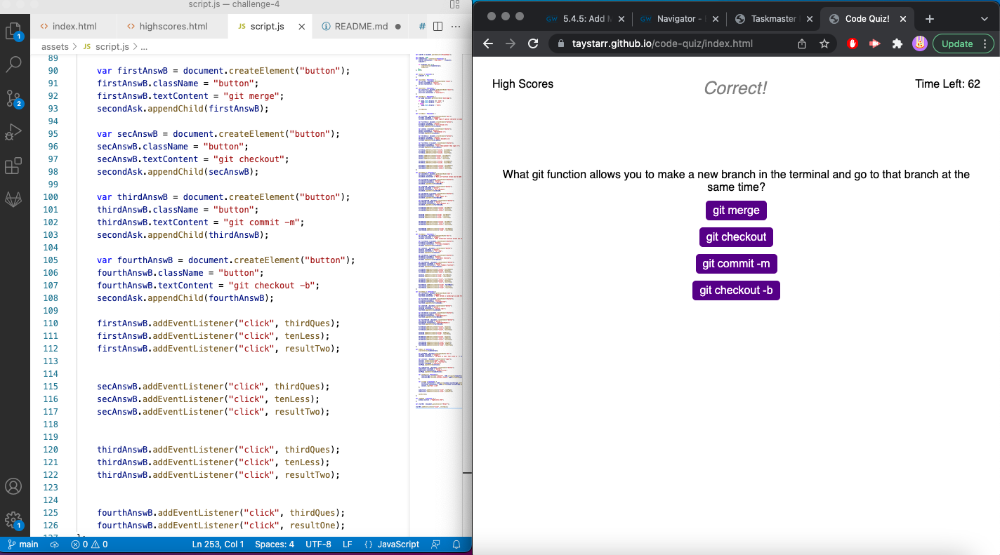

# Code Quiz

## Motivation

- My motivation for this profect was to create a quiz that would be helpful when studying coding knowledge. Although it is only four questions, it is simple to add more questions to the code for a longer quiz. Not only is this project beneficial for studying, but it is also fun to race against the clock and get the highest score.

## Problems

- I ran inot quite a few problems when making this code but was able to eventually sort them out. My biggest issue that I am hoping to solve as time goes is that the timer starts before the button is clicked. I am able to fix this problem by making it a function and then making an event listener for the start quiz button, however I needed the timer function to be universal so I could deduct time for missed questions and clear the interval when the quiz ends. Moral of the story is to start the quiz right away.

- I also ran into the issue of high score persistance, although I was able to display the score of the quiz with initials it gets replaced by the next score regardless of if it is a higher or lower score. I am hoping to fix this with a little more research into the topic.

## What I Learned

- I learned quite a bit from this project, I feel it has made me more confident in my JavaScript understanding because it forced me to look up a lot of code and go through a lot of trial and error.

- I learned how to better consolidate my code because I initially had a lot of lines of code for a very simple fix. I know my code can be further optimized and I am hoping that as I progress through this course I will be able to become more proficient at code optimization.

### Click [here](https://taystarr.github.io/code-quiz/) to take my Code Quiz!